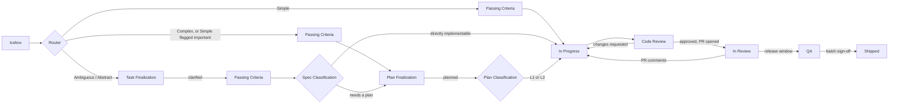
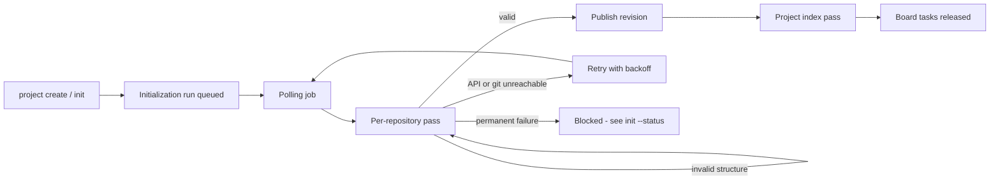

<p align="center">
  
</p>

# SprintBaton

**An asynchronous coding agent that runs on your todolist.**

[](https://github.com/arunkarthik11/SprintBaton/blob/master/LICENSE)
[](https://www.python.org/)


SprintBaton turns version-by-version product improvement into a background
process. You hand the agent the tasks you want done by labelling them on your
todolist; the agent hands tasks back to you when it needs clarification. Work
gets woven into your day at your own convenience instead of requiring you to sit
in a live coding session.

---

## Why

Coding agents have made building applications easy. But improving them - week
after week, version after version - does not stay easy. If each application has
_n_ avenues of improvement and you maintain _m_ applications, the upgrade workload grows roughly quadratically, as _n × m_, and the cost of personally attending a synchronous agent session for each one becomes prohibitive.

SprintBaton makes that loop **asynchronous**. The interface is a todolist you
already use; the agent works in the background and only interrupts you with the
clarifications that genuinely need a human.

---

## How it works

1. You onboard a **Project** - one todolist board plus the git repositories it
   drives. SprintBaton queues a one-time **initialization run** that reads each
   repository and writes the metadata that every later model reasons from.
2. You brainstorm improvements while using your app and drop them into the
   **Icebox** column as todolist tasks.
3. You hand the ones you want worked on to the agent by applying the
   `sprintbaton-agent` label.
4. A polling job picks up labelled tasks and queues them. Tasks wait in the
   Icebox until the project's first initialization has finished.
5. The **Router** classifies each task and routes it down the right path -
   answering itself, asking you, planning, or coding.
6. When the agent needs you, it comments on the task and swaps its label to
   `sprintbaton-human`. You answer in the comments whenever you have time, then
   put the `sprintbaton-agent` label back.
7. Finished work arrives as **pull requests** - one per repository the task
   touched - for your review, and merges into the `dev` integration branch; a
   scheduled release window later cuts the batch to staging for QA, then to
   live on your sign-off.

Each **Project** on your board maps to one or more git repositories (a
frontend and a backend, say). Columns carry semantic state; labels carry whose
turn it is; comments carry the human ↔ agent conversation.



## Features

- **Todolist-native interface** - no separate dashboard to babysit. Works
  through labels, columns, and comments on your existing board. Clarifying
  questions can carry a numbered list of options - reply with a number.
- **Pluggable todolist providers** - adaptor pattern with a common interface
  that can be extended by todolist providers. The Kanban board columns can be
  mapped by hand, matched by name, or created for you after you confirm the plan.
- **Multi-repository projects** - one board can drive changes across several
  repositories. A scoping step picks the repositories a task touches, each of which
  gets its own pull request, and the card follows the slowest one.
- **Pluggable agent frameworks** - the coding backend is as swappable as the
  todolist provider. Every task action runs through a named *harness*, so you
  can point any role at the in-house tool loop, the Claude Agent SDK, the
  Claude Code CLI (`claude`), the OpenAI Agents SDK / Codex CLI (`codex`), the
  Google ADK / Gemini CLI (`gemini`), or OpenHands - mixing providers per role
  via `AgentDefinition`s. `sprintbaton providers add <provider> --bind-roles`
  seeds one agent per (runtime x model tier) and binds every task action to
  them in one command; `SPRINTBATON_<ACTION>_AGENT` overrides any single one.
- **Fallback chains and usage-limit awareness** - each action can name an
  ordered chain of agents. When a provider hits a usage limit or a self-imposed
  token budget, the task walks to the next agent; only when the whole chain is
  exhausted does it pause in place until the limit resets.
- **Tiered model routing** - a classifier decides whether each task needs
  higher-tier (L2) reasoning or can run on the default (L1) tier, controlling
  cost without sacrificing reliability on the tasks that matter. Tiers are
  provider-agnostic - L1/L2 map to the models of whichever provider you bound
  the roles to.
- **Pre-PR AI review loop** - before any pull request is opened, a Review Agent
  judges the completed diff against the task and its passing criteria.
  Rejections bounce straight back to the Coding Model (same tier, no human
  visibility) for a bounded number of rounds; only an approved diff - or one
  that exhausted its bounce budget and escalated - ever reaches a human.
- **Conflict resolution** - every branch is test-merged against `dev` before
  its PR opens; a conflict is handed to a narrowly scoped Conflict Resolution
  Agent instead of surfacing as a surprise on GitHub.
- **Asynchronous clarification loop** - any role (except the Router) can pause
  on a question posted as a comment. If you answer within a few minutes it
  picks its own session back up; later answers restart the turn with the
  earlier questions and answers folded in, so nothing is lost either way.
- **Runtime escalation** - execution is monitored; mis-routed or stalled tasks
  are corrected up a tiered ladder instead of failing silently.
- **Irreversibility guardrails** - the agent never runs a destructive operation
  (migrations, data deletes, force-pushes, cluster changes) unattended; these
  hard-stop and wait for explicit human approval. Some harnesses do not allow 
  these hooks and interventions - SprintBaton warns about this on every such run.
- **Repository metadata** - an agentic initialization run explores each
  repository and extracts code insights and invariants so downstream models
  reason from facts about your codebase, not guesses. Metadata is published as
  immutable revisions, validated against a fixed structure, and retried
  automatically when the model API or git remote is briefly unreachable.
- **A shared notebook per task** - every role with a checkout finds the task,
  spec, plan, passing criteria, a running `notes.md` from earlier roles and the
  Review Agent's findings under `.sprintbaton/tasks/<task>/` in its clone. That
  folder is kept out of every commit.
- **Pull-request workflow** - opens PRs, responds to review comments, and
  runs the dev → staging → production promotion on scheduled release windows
  with a QA gate. SprintBaton opens the promotion PRs; you merge them.
- **Local tool or hosted service** - runs as a zero-infrastructure CLI on your
  machine, or multi-tenant in a cluster (MongoDB or PostgreSQL, Redis, and S3,
  Google Cloud Storage or Azure Blob Storage) with per-user encrypted
  credentials and a control-plane API. In hosted mode every command a model or
  a repository drives runs in a separate **sandbox pod** - per-run bubblewrap
  sandboxes with no network, no deployment secrets and no other tenant's files -
  so one tenant's code can never reach another's.
- **Observability** - OpenTelemetry logs and metrics (and a trace pipeline),
  plus a record of every task action with its prompt version, model and token
  use, which powers the built-in token usage reports.

---

### Model tiers

Tiers are **provider-agnostic**: the Router is the cheap classifier, **L1** is
the default coding/execution tier, and **L2** is the high-reasoning
planning/escalation tier. Which concrete model backs each tier depends on your
provider (the one you ran `providers add ... --bind-roles` for) - for Anthropic,
L1 is the Sonnet-class model and L2 the Opus-class one; escalation can
step one rung above L2 to the dedicated escalation model at E4. The Router maps
each task to an entry tier; the escalation subsystem can move it up at runtime.

| Category      | Path                                                                                      | Default tier                                   |
| ------------- | ------------------------------------------------------------------------------------------ | ----------------------------------------------- |
| **Simple**    | Passing Criteria → coding; descriptors are sufficient                                     | L1                                              |
| **Ambiguous** | Spec model → user clarification → Passing Criteria → Spec Classification → coding or plan | L1 or L2 (classifier-chosen)                    |
| **Complex**   | Passing Criteria → L2 plans → Plan Classification → coding                                | L2 plan, L1 or L2 code (classifier-chosen)      |
| **Abstract**  | Same pipeline as Ambiguous, with an Abstract-tuned finalization agent                     | L2 execution floor, regardless of the classifiers |

Importance is orthogonal to the category (`Task.important`, set by the Router's
importance flags) - an important task always executes at the L2 tier (E3) regardless of the classifiers' calls.
Important Simple/Complex tasks always plan too (important Simple enters at E2 like Complex);
important Ambiguous/Abstract tasks clarify first, then plan or not per Spec Classification.

Escalation triggers (thrashing, correctness stalls, discovered ambiguity, plan
breakage, budget exhaustion, review failure) move a task up a
cheapest-correction-first ladder (E0 retry → E1 clarify → E2 replan → E3 L2
execution → E4 escalation model → EH human handoff). Three things bypass the
ladder: discovered importance (straight to planning), and irreversible
operations or the global token cap (straight to you).

---

## Task lifecycle (Kanban columns)

```
Icebox → Task Finalization → Passing Criteria → Task Finalized → Plan Finalization
  → Plan Finalized → In Progress → Code Review → In Review → QA → Shipped
```

Simple and Complex tasks skip `Task Finalization`/`Task Finalized` entirely - they
reach `Passing Criteria` straight from the Icebox, right after Router classification - and
Simple skips `Plan Finalization`/`Plan Finalized` too, going straight from `Passing Criteria` to
`In Progress` (unless flagged important, in which case it takes the planning path like Complex).

- **Icebox** - captured ideas. A labelled task waits here, unclassified,
  until the project's first metadata initialization has succeeded.
- **Task Finalization** - awaiting your answers to clarifying questions. Shared by Ambiguous
  **and Abstract** tasks - the clarification loop is the same, but the finalization agent
  answering it differs by category (Abstract defaults to the L2 tier).
- **Passing Criteria**  - a machine-only checkpoint: given only the task's specification (the
  raw description for Simple/Complex, the finalized spec for Ambiguous/Abstract) and nothing
  else, an agent enumerates exhaustive passing/acceptance criteria before any planning or
  execution begins. These feed the Coding Model and the Review Model.
- **Task Finalized**  - the finalized spec is being classified: directly implementable
  (straight to _In Progress_) or still needs a plan (_Plan Finalization_).
- **Plan Finalization** - a plan is being generated or revised.
- **Plan Finalized** - the finalized plan is being classified: L1-implementable or
  L2-required, before entering _In Progress_.
- **In Progress** - a quick scoping step picks the repositories the task
  touches, then the Coding Model works through them one at a time. Just
  before each PR opens, the branch is test-merged against `dev` and any
  conflict goes to the Conflict Resolution Agent.
- **Code Review**  - a machine-only gate: the Review Agent judges the completed diff
  against the task and its passing criteria before any PR exists. Rejections bounce
  straight back to _In Progress_ (same tier, no human visibility) for a bounded number
  of rounds; only approved diffs - or ones that exhausted the bounce budget and
  escalated - ever reach _In Review_.
- **In Review** - a PR per affected repository is open against `dev`; your
  comments bounce the commented repositories back to _In Progress_. Once every
  PR has merged, the task sits here until the next release window.
- **QA** - the scheduled release window swept the task's batch from `dev` to
  `staging` for regression QA. Handing any task of the batch back to the agent
  (re-applying `sprintbaton-agent`) signs the whole release off.
- **Shipped** - the okayed release promoted `staging` to `production` (live);
  every task in the batch moves here together.
- **Blocked** (optional column) - the agent needs a human decision it cannot
  make, and says why in a comment. Without the column the card goes to _Task
  Finalization_ with a `sprintbaton-blocked` label instead.

### Editing and moving cards

The board is also how you steer work that is already under way. SprintBaton
only *observes* your card on each poll; the worker decides what that means at
the start of its next pass.

- **Edit the title or description** - every edit is kept as a numbered
  revision, and every spec, plan and set of criteria remembers which revision
  it was built from. A cheap classifier decides how far back the edit reaches
  (nothing, the code, the plan, the criteria, the spec, or the whole task).
  Before any code exists the task just redoes from there and says so in a
  comment. Once code exists it asks you first: redo from that point, amend
  the code only, or keep going. Whitespace-only edits are ignored, and edits
  to work that is already merged are noted but not applied.
- **Move a card forward** - it continues from that column. Anything the
  column strictly needs (a classification, criteria) is worked out quietly,
  without dragging the card back through the skipped columns. QA is the
  exception: it means the PRs are merged, and merging happens on GitHub, so
  the card is moved back with a note if they aren't.
- **Move a card out of QA** - only Shipped is accepted. The code is already
  merged into a release, so to rework it, ship it and then move it back.
- **Move a card backward** - that stage is redone, with the previous output
  and any comment you left as guidance. Branches and PRs are kept: new work
  goes on top of the existing branch and updates the open PR.
- **Move a card to a column SprintBaton doesn't know** (or into Blocked) - the
  task is parked with everything intact. Move it back to resume.
- **Move a shipped card back** - the same card starts a new round of work on a
  fresh branch from `dev`, with the previous round as context.
- **Move a card to Shipped** - declares it done, outside any release.

### Project initialization

The metadata run never appears on your board. It is an invisible task that
`sprintbaton serve` picks up like any other, runs on the project owner's own
agents and credentials, and publishes as a new revision only once the result
passes validation:



Automatic runs happen on first onboarding and whenever a repository is added;
re-run it yourself with `sprintbaton init` after significant changes. If the
first run fails, board tasks keep waiting - fix the cause and re-run, open the
gate with `sprintbaton project metadata-gate "<title>" --open`, or opt out of
automatic runs (and the wait) with `generateMetadata: false`.

---

## Install

SprintBaton ships as one Python package. The base install carries no model
provider SDK and no storage client - you add the ones you use as extras.

```bash
pip install "sprintbaton[anthropic,claude-agent-sdk]"   # CLI/local tool with the
                                                        # Anthropic SDKs: SQLite,
                                                        # filesystem blobs,
                                                        # in-process queue, flock
pip install sprintbaton                                 # a claude / codex / gemini
                                                        # CLI-only setup - no
                                                        # provider SDK needed
pip install "sprintbaton[hosted,anthropic,claude-agent-sdk]"   # + every storage
                                                        # client and the
                                                        # serve-api API
```

Or install from a checkout, with the same extras:

```bash
git clone https://github.com/arunkarthik11/SprintBaton.git
cd SprintBaton
pip install -e .                                  # CLI-only setup
pip install -e ".[anthropic,claude-agent-sdk]"    # + the Anthropic SDKs
pip install -e ".[hosted,anthropic,claude-agent-sdk]"   # + every storage client
                                                  # and the serve-api API
```

**Provider extras** - one per in-process SDK. A setup that uses only the
`claude`, `codex` or `gemini` CLIs (`claude_code_cli`, `codex_cli`,
`gemini_cli`) needs none of them.

| Extra | Needed for |
|---|---|
| `anthropic` | the `single_shot` and `raw_tool_loop` harnesses |
| `claude-agent-sdk` | the `claude_agent_sdk` harness (bundles the `claude` executable) |
| `openai`, `openai-agents` | `openai_single_shot`, `openai_agent_sdk` |
| `google-genai`, `google-adk` | `gemini_single_shot`, `gemini_agent_sdk` |
| `openhands` | `open_hands` |

You rarely need to pick these by hand: in a CLI install, `sprintbaton setup`
and `providers add` install the extras for the harnesses you choose (pass
`providers add --skip-install` to opt out). In hosted mode nothing is installed at runtime -
they print the extra to add to the image instead. Using a harness whose package
is missing fails with an error naming the extra.

**Storage and service extras** - only for hosted mode:

| Extra | Contents |
|---|---|
| `mongo` / `postgres` | MongoDB / PostgreSQL entity persistence |
| `s3` / `gcs` / `azure` | S3 (and S3-compatible) / Google Cloud Storage / Azure Blob Storage blobs |
| `redis` | the hosted queue, lock and config cache |
| `api` | `sprintbaton serve-api` (fastapi/uvicorn/bcrypt) |
| `otlp` | the OTLP gRPC exporter |
| `hosted` | all of the above - every storage client, no provider SDK |

A plain CLI install runs against nothing but a SQLite file, the filesystem, and
stdlib locking, all under `~/.sprintbaton/` by default
(`SPRINTBATON_LOCAL_STORAGE_ROOT`).

### Prerequisites

- Python 3.12+ and `git`
- Access to one model provider - Anthropic, OpenAI or Google - either as an
  API key or as a logged-in CLI (`claude`, `codex` or `gemini`). A CLI install
  needs no API key at all: when the provider's CLI is on your `PATH`,
  `sprintbaton setup` puts every role on it and it authenticates from your
  login - see [CLI-based coding
  backends](#cli-based-coding-backends-claude-code-codex-gemini) below
- A supported todolist provider account and API token (Todoist today)
- A GitHub token with repo access for the repositories you onboard

Copy `.env.example` to `.env` and fill in the values you need - SprintBaton
reads config via `pydantic-settings`, so anything set in the environment or
`.env` overrides the defaults.

```bash
cp .env.example .env
```

#### CLI-based coding backends (Claude Code, Codex, Gemini)

SprintBaton can drive the vendor coding CLIs directly as harnesses instead of
making metered API calls. Each one runs the real `claude` / `codex` / `gemini`
binary headlessly and authenticates purely from that CLI's own login on the
machine running `sprintbaton serve`. These runs draw from your subscription's
usage pool rather than metered API billing - a cost split subject to each
vendor's own billing policy, not a SprintBaton guarantee.

| Harness           | CLI binary | Login command        | Provider   | What it can do today |
| ----------------- | ---------- | -------------------- | ---------- | -------------------- |
| `claude_code_cli` | `claude`   | `claude login`       | anthropic  | every role,          |
| `codex_cli`       | `codex`    | `codex login`        | openai     | every role;          |
| `gemini_cli`      | `gemini`   | `gemini auth login`  | google     | every role;          |

A few things hold for all three:

- **Login-only.** SprintBaton never forwards an API key to them, and it strips
  `ANTHROPIC_API_KEY` / `OPENAI_API_KEY` / `GEMINI_API_KEY` / `GOOGLE_API_KEY`
  from their environment. A key you happen to have exported can never quietly
  decide which account a run is billed to.
- **Tool mode only.** They run their tools directly on the host, so they can't
  be sandboxed, and a hosted deployment refuses them. `codex` and `gemini`
  also keep their login on disk (`~/.codex/auth.json`, `~/.gemini/`), which a
  hosted worker couldn't use anyway. An agent that names one where it can't run
  is refused when you create it, not when a task reaches it.
- **Chains soften the edges.** List an API or SDK agent after the CLI one
  (`SPRINTBATON_REVIEW_AGENT=openai-cli-code,openai-sdk-code`) and the resolver
  skips the entry it can't use.

For Codex, `providers add openai` with a `cli` runtime also adds SprintBaton's
guard hook to your
`~/.codex/hooks.json` (your own entries are kept, and the file is backed up).
Codex only runs hooks you have trusted, so open `codex`, go to `/hooks` and
trust the SprintBaton entry once - until you do, its write-mode runs go
unguarded and warn on every run.

In tool mode (`SPRINTBATON_MODE=tool`, the default), both runtime flags default
to `cli` - provided that provider's binary is on `PATH` - so `sprintbaton setup`
/ `providers add --bind-roles` puts every role on that provider's CLI.
**No metered API key is needed for any role** in that configuration. It does
need a valid CLI login on the worker machine; without one, the first run fails
with a clear message. If the binary isn't on `PATH`, the defaults fall back to
the API and agent-SDK runtimes instead.

The two decisions are independent, so you can keep the five cheap router-tier
roles on the metered API and everything else on a CLI login:

```bash
sprintbaton providers add anthropic --classify-harness api \
    --agentic-harness cli --bind-roles
```

Whether a call uses a subscription depends only on the harness and on the
**task owner's own credentials** - never on who the owner is, and never on a
subscription the deployment holds:

1. a harness that can use a Claude subscription, and an owner who stored one
   (`sprintbaton credentials create --provider anthropic_subscription --token
   <claude setup-token output>`) - runs on that subscription;
2. otherwise a harness that takes an API key, and an owner (or the deployment
   fallback) with one - metered;
3. otherwise, in tool mode only, a CLI harness authenticates from the host's own
   login (`claude login`, `codex login`, `gemini auth login`).

In hosted mode the defaults put the agentic roles on the provider's agent SDK.
For Anthropic that is the Claude Agent SDK, whose `claude` binary runs inside the
sandbox pod. With a stored subscription the run holds only a placeholder token;
the worker's egress broker swaps in the real one on the way to Anthropic, so the
credential never enters the sandbox. `CLAUDE_CODE_OAUTH_TOKEN` is a tool-mode
convenience only: a hosted worker never lends the operator's subscription to
anyone.

---

## Quick start

```bash
# 1. First-run configuration, interactively: credentials, model provider,
#    seeded agents, and the role bindings every task action resolves through.
sprintbaton setup

# 2. Onboard a project - the board↔repositories mapping. This also queues
#    the project's first metadata initialization run.
sprintbaton project create -f my-web-app.yaml

# 3. Start the worker: polling job + orchestrator. It picks up the
#    initialization run first (L2-tier, can take a while).
sprintbaton serve

# 4. In another terminal, check on the initialization run.
sprintbaton init --project "My Web App" --status
```

`setup` needs a terminal. Everything it does is reachable non-interactively, so
CI and provisioning scripts never need it:

```bash
sprintbaton credentials create --provider github  --token ghp_...
sprintbaton credentials create --provider todoist --token tok_...
sprintbaton providers add anthropic --bind-roles      # seeds agents + binds every action
sprintbaton project create -f my-web-app.yaml
sprintbaton init --project "My Web App"
sprintbaton serve
```

**`providers add ... --bind-roles` is required at least once.** There is no
built-in default wiring: every task action resolves through a binding to a
persisted `AgentDefinition`, and `sprintbaton serve` prints a warning naming any
action that has none.

Label a task `sprintbaton-agent` on your board and it's picked up on the next
poll once initialization has finished.

---

## Command reference

### `sprintbaton project create|list|delete|metadata-gate`

Onboard and manage `Project` rows - one todolist board and its member
repositories (columns, board, release cadence, todolist provider, per-repository
branches, credential overrides). `sprintbaton repo …` is a back-compat alias
for the same group.

```bash
sprintbaton project create -f my-web-app.yaml        # upsert by metadata.name
sprintbaton project list
sprintbaton project delete "My Web App"              # soft-delete
sprintbaton project metadata-gate "My Web App" --open    # let board tasks run
                                                         # before metadata exists
sprintbaton project metadata-gate "My Web App" --enforce
```

`project create` applies a k8s-style manifest:

```yaml
apiVersion: sprintbaton/v1
kind: Project
metadata:
  name: "My Web App"
spec:
  boardId: "board_abc123"        # omit this and `columns` if createTodolistProject: true
  todolistProvider: todoist
  # createTodolistProject: true    # provisions a template board + sections instead
  releaseCadenceDays: 7            # dev → staging cutover window (weekly)
  columns:                         # provider column/section IDs → semantic states
    icebox: "col_1"                # any subset may be omitted on Todoist - see below
    taskFinalization: "col_2"      # shared by Ambiguous and Abstract tasks
    passingCriteria: "col_2a"      # exhaustive acceptance criteria (machine-only)
    taskFinalized: "col_2b"        # spec classification checkpoint (machine-only)
    planFinalization: "col_3"
    planFinalized: "col_3b"        # plan classification checkpoint (machine-only)
    inProgress: "col_4"
    codeReview: "col_4b"           # pre-PR Review Agent gate (machine-only)
    inReview: "col_5"
    qa: "col_6"
    shipped: "col_7"
    # blocked: "col_8"             # optional; halts fall back to a label without it
  credentials:
    todolist: cred_def456          # falls back to your default credential, then TODOLIST_API_TOKEN
  git:                             # optional commit identity for every member repo
    authorName: "SprintBaton"
    authorEmail: "sprintbaton@users.noreply.github.com"
  generateMetadata: true           # default; false = no automatic runs, tasks never wait for one
  metadataGuidance: |              # optional, ≤ 4000 chars, passed to the metadata agents
    Payments live in services/billing and are the critical surface.
  active: true                     # false pauses new-task intake (in-flight work continues)
  repositories:
    - name: "web-frontend"
      role: "frontend UI"
      remoteUrl: "git@github.com:your-org/web-frontend.git"
      githubRepo: "your-org/web-frontend"
      branches:
        dev: dev                   # integration trunk feature PRs merge into
        staging: staging           # release-window batch under regression QA
        production: main           # live
      credentials:
        github: cred_abc123        # falls back to your default credential, then GITHUB_TOKEN
    - name: "web-backend"
      role: "backend API"
      remoteUrl: "git@github.com:your-org/web-backend.git"
      githubRepo: "your-org/web-backend"
```

On Todoist, `columns` is optional: unmapped keys are matched against the
board's existing sections by name, and the rest are proposed for creation -
nothing is created until you confirm the plan at the prompt. Other providers
require the full mapping. Linking a Todoist project also creates the
`sprintbaton-agent` (salmon) and `sprintbaton-human` (green) routing labels.

A new project, or a newly added repository, queues a metadata initialization
run automatically. Changing only `metadataGuidance` does not - the command
prints a hint to re-run `sprintbaton init`.

### `sprintbaton init`

Queues a metadata initialization run - an L2-tier agentic read of every member
repository that produces the `.sprintbaton/` insight files the Router, Spec,
Planning, and Coding models read from, then the combined project index.
`sprintbaton serve` executes it; `init` itself never calls a model or clones a
repository. Run it again whenever the codebase has changed significantly.

```bash
sprintbaton init --project "My Web App"                  # regenerate every repository
sprintbaton init --project "My Web App" --missing-only   # only repositories with no metadata yet
sprintbaton init --project "My Web App" --wait           # block until the run finishes
sprintbaton init --project "My Web App" --status         # latest run, per-repo progress, gate state
```

`init` is purely per-project. Provider choice is not an `init` flag: it is a
deployment-wide decision, expressed by `sprintbaton setup` or `providers add
<provider> --bind-roles`.

Only one run per project can be unfinished at a time. A run that fails
permanently shows its error and remedies in `--status`; brief outages are
retried with backoff on their own.

Flags: `--verbose`/`-v` (stream reasoning traces), `--quiet`/`-q` (warnings
only), `--json` (force structured JSON output).

### `sprintbaton serve`

Starts the polling job, the release-window job, the usage-limit-wake job, the
workspace sweeper, and the orchestrator worker loop. This is the long-running process - run it as a
daemon, systemd unit, or container. On startup it re-enqueues tasks orphaned by
a crash and prints any project whose first metadata initialization failed.

```bash
sprintbaton serve
sprintbaton serve --verbose       # live reasoning traces from the harnesses
sprintbaton serve --quiet         # warnings and errors only
```

`Ctrl+C` stops all four background jobs cleanly. In hosted mode `serve` refuses
to start unless the sandbox service is configured and reachable
(`SPRINTBATON_SANDBOX_URL` + `SPRINTBATON_SANDBOX_TOKEN`) - it never falls back to
running tenant code in its own process - and it starts the egress/credential
broker the sandbox's runs reach the network through.

At startup `serve` also checks that every harness reachable from a bound action
(each fallback-chain entry and each execution tier) can import its packages.
A missing one is reported with the action, the agent, the package and the extra
that provides it. Tool mode only warns. Hosted mode refuses to start when an
action has no usable agent left, since that means the image was built without
a package its bindings need - add the extra to the `PROVIDER_EXTRAS` build
argument. A chain that still has a usable entry is only a warning.

### `sprintbaton serve-api`

Starts the hosted-mode CRUD API (`fastapi`/`uvicorn`) - a second front door
onto the same storage `sprintbaton serve` acts on, meant to back a future web
UI. Requires the `api` extra (included in `[hosted]`). CLI/local installs never need this.

```bash
sprintbaton serve-api
sprintbaton serve-api --host 0.0.0.0 --port 8080
```

| Route | Purpose |
| ----- | ------- |
| `POST /accounts`, `POST /auth/login` | Sign up / log in; both return a bearer token |
| `GET/POST /agents`, `DELETE /agents/{id}` | AgentDefinitions. `422` for an unknown harness or `systemPrompt` template, or a harness that can't run on this deployment; known harness caveats come back as `warnings` on the `201` |
| `GET/POST /credentials`, `DELETE /credentials/{id}` | Encrypted credentials (masked on read) |
| `GET/POST /projects`, `DELETE /projects/{id}` | Projects and their member repositories; `409` returns a column plan to confirm |
| `POST/GET /projects/{id}/metadata` | Queue an initialization run (`409` with the unfinished run's `taskId`) / its status |
| `PUT /projects/{id}/metadata/gate` | Open or enforce the metadata gate |
| `GET/PATCH /config` | Per-user configuration overrides, including all 15 agent bindings |
| `GET /reports/usage/timeseries\|by-task\|by-agent\|by-state` | Token usage reports |

Every route is scoped to the caller - another user's ids return `404`.

### `sprintbaton credentials create|list|delete`

Encrypted, named third-party tokens a project or repository can reference by
id, or that become your default for a provider automatically.

```bash
sprintbaton credentials create --provider github --token ghp_...   # first one becomes default
sprintbaton credentials create --provider todoist --token tok_... --no-default
sprintbaton credentials list      # masked - plaintext is never shown
sprintbaton credentials delete <credential_id>
```

Known providers: `github`, `todoist`, `linear`, `anthropic`, `anthropic_subscription`,
`openai`, `gemini`, `open_hands_llm`. `anthropic_subscription` is a Claude
subscription token minted by `claude setup-token`; a harness that can use a
subscription prefers it over an API key whenever you have stored one (store no
subscription credential if you want metered spend).

### `sprintbaton` (no command)

`sprintbaton` must be followed by a command. Run on its own it is an error
(exit status 2) that says so and lists where to start:

```text
$ sprintbaton
error: missing command - `sprintbaton` must be followed by a command
  likely cause: it was run on its own, with nothing after it
  to fix: run one of these:
    sprintbaton setup    set SprintBaton up (credentials, model provider, role bindings)
    sprintbaton --help   list every command and option
```

A command group on its own (`sprintbaton providers`, `agents`, `project`,
`credentials`) is the same error, listing that group's commands.

### Errors

Every error the CLI prints has the same three parts - what failed, the likely
cause, and the command that fixes it:

```text
$ sprintbaton init --project shop
error: unknown project: shop
  likely cause: the project was never onboarded, or the title is misspelled (titles are matched exactly)
  to fix: `sprintbaton project list` shows the onboarded titles; onboard a new one with `sprintbaton project create -f <manifest.yaml>`
```

That covers startup problems too: an unsupported setting, a database or queue
that cannot be reached, and a missing optional package (which names the
`pip install 'sprintbaton[<extra>]'` to run) are reported this way instead of
as a traceback. Errors go to stderr and exit with status 1.

### `sprintbaton setup`

The interactive front door for a first run: stores your GitHub and Todoist
tokens, picks a model provider (probing `PATH` for `claude`, `codex` and
`gemini` so it can tell you which CLIs you already have), chooses the two
runtimes, seeds the agents, and binds every task action to them. It only asks
for an API key when some role could actually use one, and on Anthropic's
agent-SDK runtime it also offers to store a Claude subscription token.

```bash
sprintbaton setup
```

It opens with the SprintBaton logo typed out as a short animation, then a
welcome and an outline of the steps. Set `SPRINTBATON_NO_ANIMATION=true` for a
still logo; a terminal without 24-bit colour, narrower than 79 columns, or with
`NO_COLOR` set gets plain text art instead. `sprintbaton serve` shows the same
logo as a still frame in tool mode (never with `--quiet`, `--json`, or when
output is not a terminal).

It is a thin wrapper - it calls exactly what `credentials create` and `providers
add --bind-roles` call, and owns nothing of its own. It needs a terminal and
refuses rather than prompting when stdin is a pipe; the scripted equivalent is
in [Quick start](#quick-start). Re-running is safe: every step it performs is
create-if-absent. To *change* an existing provider's wiring, use `providers
update`.

### `sprintbaton providers add|update|list|delete|set-limit`

Register a model provider: installs the optional pip extra of each selected
runtime's harness, warns if its CLI binary is missing, optionally captures a
credential, seeds one `AgentDefinition` per (runtime x model tier), and with
`--bind-roles` binds every task action - including the per-tier execution map -
to them.

```bash
sprintbaton providers add anthropic --bind-roles              # the mode defaults:
                                                             # tool -> cli/cli,
                                                             # hosted -> api/agent_sdk
sprintbaton providers add openai --token sk-... --bind-roles
sprintbaton providers add google --classify-harness api --agentic-harness cli
sprintbaton providers add anthropic --base-url https://gateway.example.com   # an Anthropic-compatible gateway
sprintbaton providers list
sprintbaton providers set-limit openai --max-tokens 2000000 --window-seconds 3600
sprintbaton providers delete openai
```

Two independent decisions, along the seam the pipeline already has:

| Flag | Values | Covers |
|---|---|---|
| `--classify-harness` | `default`, `api`, `cli`, `agent_sdk` | the five cheap router-tier roles (classification, spec/plan classification, repo scoping, revision classification) |
| `--agentic-harness`  | `default`, `cli`, `agent_sdk`        | the other nine |

`default` resolves per mode: `cli` for both in a CLI install, `api` + `agent_sdk`
in hosted mode - tool mode assumes you have a CLI login, hosted mode assumes you
have an API key. In tool mode the `cli` default also needs the provider's
binary on `PATH`; without it you get `api` + `agent_sdk`. Selecting `cli`
explicitly in hosted mode warns, since the CLI harnesses can't run there. There
is deliberately no `api` agentic runtime: SprintBaton has no agentic-API harness
beyond Anthropic's legacy `raw_tool_loop`, which stays reachable through
`SPRINTBATON_CODING_HARNESS`.

Each invocation seeds four rows - `<provider>-<runtime>-router`, `-code`, `-plan`
and `-escalate` - at that provider's router / coding / planning / escalation
models. Nothing is ever deleted, so a second invocation with a different runtime
adds candidates alongside the first (`openai-cli-code` and `openai-sdk-code` can
both exist, and either can be bound). When `SPRINTBATON_CODING_HARNESS` names a
harness other than the chosen agentic runtime's, three extra
`<provider>-exec-*` rows are seeded on it and the write-capable roles (execution,
conflict resolution) bind to those instead - which is how the read-only advisory
roles and the coding roles keep different harnesses.

`--base-url` (manifest `spec.baseUrl`, `https://` only) points a provider at an
endpoint other than its default - for example an Anthropic-compatible gateway in
front of a non-Claude model. A `claude_agent_sdk` agent on such a provider works
but carries an advisory (Anthropic does not support non-Claude models behind
Claude Code); it is surfaced at `agents create`, `POST /agents` and on every run,
never blocking.

`providers add` is create-if-absent throughout, including the provider row, so
re-running it is a no-op. `providers update` is the deliberate mutation, and
`--bind-roles` switches which job it does rather than adding a second one:

```bash
sprintbaton providers update openai                # re-seed row contents from
                                                   # current Settings; bindings untouched
sprintbaton providers update openai --bind-roles   # bind the roles to the existing
                                                   # rows; row contents untouched
```

One axis of change per invocation, so a behavior change is always attributable.
Note the consequence: a model id moved in `SPRINTBATON_OPENAI_CODING_MODEL` (or
any tier setting) reaches tasks on the next `providers update`, not on the next
task - seeded rows are data, not a live view of your environment.

`set-limit` attaches a self-imposed rolling-window token budget - the ceiling the
fallback router honors when walking an agent chain (add `--replace` to swap out
the existing limits instead of adding one). `providers list` shows every
provider with the install state of each of its harnesses.

A few more knobs on `providers add`: `--token` stores an API key as you
register, `-f provider.yaml` takes the same settings from a manifest,
`--no-seed-agents` registers the provider without creating any agents, and
`--skip-install` leaves pip alone.

### `sprintbaton agents create|list|delete|harnesses`

Manage `AgentDefinition`s directly - named `(harness, provider, model)` recipes,
optionally with a **system preamble**. This is the deliberate override; the
normal way to wire a whole provider is `providers add --bind-roles` above.

```bash
sprintbaton agents harnesses                       # list registered harness names
sprintbaton agents create --name sonnet-coder \
    --harness raw_tool_loop --provider anthropic --model claude-sonnet-5
sprintbaton agents create --name strict-sonnet \
    --harness claude_agent_sdk --model claude-sonnet-5 \
    --system-prompt strict-json                    # a template you add, see below
sprintbaton agents list
sprintbaton agents delete sonnet-coder
```

`--system-prompt` names a template that is **prepended** before whichever action
template runs - model-specific standing instructions ("stricter JSON
discipline", "prefer minimal diffs"), reusable across every action the agent is
bound to. No preambles ship with SprintBaton: you add your own as a Markdown file
next to the built-in templates in `sprintbaton/prompts/templates/` (so
`strict-json` above means `strict-json.md`). It is used exactly as written and
never replaces the action's own template, so it cannot drift out of step with
that action's output schema. An unknown template name is rejected here, not
once per task at run time.

`agents harnesses` lists every harness you can name and marks the ones with
known upstream caveats with ⚠; `agents create` prints those caveats when you
pick one. `--provider` defaults to `anthropic` and must name a built-in
provider (`anthropic`, `openai`, `google`, `open_hands_llm`) or one you
registered with `providers add`.

Bind an agent to an action with `SPRINTBATON_<ACTION>_AGENT` (a single name, or a
comma-separated fallback chain).

### `sprintbaton reports [timeseries|by-task|by-agent|by-state]`

Token usage reports over the `TaskActionEvent` stream - metadata initialization
runs included. No subcommand means `by-task` over the last 7 days.

```bash
sprintbaton reports                                    # by-task, last 7 days
sprintbaton reports by-task --repo "web-backend" --days 30
sprintbaton reports by-task --task task_abc123
sprintbaton reports by-agent --since 2026-07-01 --until 2026-07-19
sprintbaton reports by-state --days 14
sprintbaton reports timeseries --bucket week --days 90
```

Every subcommand accepts `--days`, `--since`/`--until` (ISO dates, override
`--days`), and `--repo` (restrict to one repository by title); `by-task` also
takes `--task`. `--days` defaults to `SPRINTBATON_REPORT_DEFAULT_DAYS` (7).

---

## Global flags

`init` and `serve` both accept:

| Flag              | Effect                                                |
| ------------------ | ------------------------------------------------------ |
| `--verbose` / `-v` | Floor logging at DEBUG and stream live reasoning traces from the harnesses |
| `--quiet` / `-q`   | Floor logging at WARNING - suppress the normal key-transition log lines |
| `--json`           | Force structured JSON log output even in an interactive tool-mode TTY |

Without any of these, verbosity follows `SPRINTBATON_LOG_VERBOSITY`
(`normal` by default) and tool-mode interactive runs get a colorized,
human-readable console renderer instead of raw JSON lines.

---

## Install modes

| | CLI / local (default) | Hosted |
|---|---|---|
| Install | `pip install "sprintbaton[anthropic,claude-agent-sdk]"` (or bare, for a CLI-only setup) | the published image, or `pip install "sprintbaton[hosted,anthropic,claude-agent-sdk]"` |
| `SPRINTBATON_MODE` | `tool` | `hosted` |
| Entity storage | SQLite (`~/.sprintbaton/sprintbaton.db`) | MongoDB (default) or PostgreSQL |
| Blob storage | filesystem (`~/.sprintbaton/blobs/`) | S3 / any S3-compatible store (default), Google Cloud Storage, or Azure Blob Storage |
| Queue | in-process | Redis |
| Lock | `flock` | Redis |
| Users | one, fixed (`local`) | many, each with their own projects, agents, and credentials |
| Default runtimes | your provider's CLI (`claude` / `codex` / `gemini`) when it's on `PATH`, otherwise its API + agent SDK | API for the router roles, agent SDK for the rest (Anthropic's coding roles on `raw_tool_loop`, per `SPRINTBATON_CODING_HARNESS`) |
| Where tools and tests run | your machine, in the task's clone | the sandbox pod, one bubblewrap sandbox per run |
| `serve-api` | optional (`api` extra) | included in the image |
| External infra required | none | a database, Redis, an object store, the sandbox service |

A hosted install is three workloads: the worker (`sprintbaton serve` - the
orchestrator, git, model API calls and the egress/credential broker), the
**sandbox service** (`Dockerfile.sandbox`, `python -m sprintbaton.sandbox.server`)
and the optional API. The worker holds the deployment's secrets and runs only
trusted code; every command a model or a repository drives - tool calls, test
and build scripts, the `claude` binary itself - runs in the sandbox pod, which
holds no secret but the worker<->sandbox token and shares no volume with the
worker (files move through an explicit transfer; changes come back as a
validated change set the worker applies to its own clone). Runs have no network
except package registries and the model API, both through the worker's broker.
The cluster must run a NetworkPolicy-enforcing CNI, and the sandbox nodes must
either allow unprivileged user namespaces or grant the sandbox container
`CAP_SYS_ADMIN`.

Hosted storage is chosen by configuration: `SPRINTBATON_PERSISTENCE_BACKEND`
(`mongo` or `postgres`) and `SPRINTBATON_BLOB_BACKEND` (`s3`, `gcs` or
`azure`), each with its own settings in the configuration reference below.
Redis is the only hosted queue and lock. A deployment's blob backend is fixed
once it holds data - stored artifact URLs name their vendor (`s3://`, `gs://`,
`azure://`) and there is no migration tooling.

You don't have to build anything to run hosted mode - each release publishes
both images (`ghcr.io/arunkarthik11/sprintbaton` and `sprintbaton-sandbox`,
linux/amd64 + arm64, built with the same SDK) and two ready-made setups:

- **Docker Compose** (`deploy/compose/`) - one host, batteries included: the
  three workloads plus Redis and, by default, MongoDB and MinIO (PostgreSQL is
  a compose profile away). Run `./init-env.sh`, add your keys to `.env`, then
  `docker compose up -d`.
- **Helm** (`deploy/helm/sprintbaton/`, also at
  `oci://ghcr.io/arunkarthik11/charts/sprintbaton`) - pick
  `persistence.backend` and `blob.backend`, then point them at your own stores
  (inline values or existing Secrets) or the bundled single-replica ones
  (`values-bundled.yaml`). `values-aws.yaml`, `values-gcp.yaml` and
  `values-azure.yaml` are cloud presets using workload identity for the object
  store.

Each directory's README covers the host/cluster requirements for the sandbox.

**The published image** contains every storage client (so any backend
combination is a configuration change) and the Anthropic provider packages
only. It is defined by two build arguments of the same `Dockerfile`:
`STORAGE_EXTRAS` (default `mongo,postgres,s3,gcs,azure,redis,api,otlp`) and
`PROVIDER_EXTRAS` (default `anthropic,claude-agent-sdk`). To use another
provider's SDK, build your own worker and sandbox images together from
`docker-bake.hcl`:

```bash
PROVIDER_EXTRAS=openai-agents,openai REGISTRY=registry.example.com/me TAG=custom \
  docker buildx bake --push
```

Both images must come from one build - the sandbox's `claude` binary has to
match the worker's `claude-agent-sdk`, and a build without `claude-agent-sdk`
omits it from the sandbox entirely. Custom builds aren't built or tested by the
project's CI. `sprintbaton serve` checks at startup that every bound agent's
harness can import its packages; in hosted mode it refuses to start (naming the
extra to add to `PROVIDER_EXTRAS`) when an action has no usable agent left.

Deleting `~/.sprintbaton/` (and your `WORKSPACE_ROOT`, if you moved it out of
there) is a clean reset of a local install. Per-concern backends can also be overridden individually
(`SPRINTBATON_PERSISTENCE_BACKEND`, `SPRINTBATON_BLOB_BACKEND`,
`SPRINTBATON_QUEUE_BACKEND`, `SPRINTBATON_LOCK_BACKEND`) regardless of the
overall mode.

---

## Development

```bash
python -m venv .venv && .venv/bin/pip install -e ".[dev]"
.venv/bin/pytest
```

`[dev]` pulls in `[hosted]` and both Anthropic extras, because the suite
exercises every storage driver, the `serve-api` control-plane API, and the
Anthropic harnesses. Tests that need real services (Mongo, PostgreSQL, Redis,
MinIO/S3, GCS, Azure, a live Todoist account, or a real harness run) are skipped
unless `SPRINTBATON_CONFORMANCE_LIVE=1` is set - plus `POSTGRES_DSN` for
PostgreSQL, `GCS_BUCKET` for GCS, and the `AZURE_*` settings for Azure. The
cloud blob drivers also run against in-memory fakes of their client libraries
on every test run.

The test suite lives in the development repository and isn't part of the
public release, so a checkout of the public repo has no `tests/` to run.

---

## Configuration reference

**Providers, models, and credentials**

| Variable                        | Required | Default                     | Description                                     |
| ------------------------------- | -------- | --------------------------- | ----------------------------------------------- |
| `ANTHROPIC_API_KEY`             | no*      | -                           | Anthropic API key. *Needed only by metered harnesses when no per-user Anthropic `Credential` exists; it is the deployment-wide fallback (tier 3 of the credential chain). A `claude login` or a stored subscription covers the CLI and agent-SDK roles without it |
| `CLAUDE_CODE_OAUTH_TOKEN`       | no       | -                           | Tool mode only: a Claude subscription token (`claude setup-token`) used when the owner has stored none of their own. Ignored in hosted mode - each hosted user stores their own `anthropic_subscription` credential |
| `SPRINTBATON_LOCAL_LOGIN_SESSIONS` | no    | (mode-derived)              | May harnesses authenticate from a login that lives only on this machine's filesystem (`claude login`, `codex login`, `gemini auth login`)? Unset derives from `SPRINTBATON_MODE`; always false in hosted mode |
| `OPENAI_API_KEY`                | no       | -                           | Deployment-wide OpenAI fallback key (per-user `Credential`/provider wins); used by `openai_single_shot` and `openai_agent_sdk`, never passed to `codex_cli` |
| `GEMINI_API_KEY`                | no       | -                           | Deployment-wide Google fallback key (same three-tier resolution); used by `gemini_single_shot` and `gemini_agent_sdk`, never passed to `gemini_cli` |
| `SPRINTBATON_DEFAULT_PROVIDER`  | no       | `anthropic`                 | Which provider `sprintbaton setup` offers first and a bare `providers update` targets (`anthropic`/`openai`/`google`). **Not** a resolution input - every action resolves through an explicit binding. Written by `providers add --bind-roles` |
| `SPRINTBATON_OPUS_MODEL`        | no       | `claude-opus-4-8`           | Anthropic L2 (high-tier reasoning/planning) model |
| `SPRINTBATON_SONNET_MODEL`      | no       | `claude-sonnet-5`           | Anthropic L1 (default coding/execution) model   |
| `SPRINTBATON_ROUTER_MODEL`      | no       | `claude-haiku-4-5`          | Anthropic cheap classifier for routing          |
| `SPRINTBATON_FABLE_MODEL`       | no       | `claude-fable-5`            | The E4 escalation tier's model (reached only by escalation from E3); also the Conflict Resolution Agent's default |
| `SPRINTBATON_OPENAI_ROUTER_MODEL` / `_CODING_MODEL` / `_PLANNING_MODEL` / `_ESCALATION_MODEL` | no | `gpt-5-mini` / `gpt-5-codex` / `gpt-5.1` / `gpt-5.1-pro` | Tier models `providers add\|update openai` seeds its rows with (placeholders - verify the catalog before pinning) |
| `SPRINTBATON_GEMINI_ROUTER_MODEL` / `_CODING_MODEL` / `_PLANNING_MODEL` / `_ESCALATION_MODEL` | no | `gemini-3-flash` / `gemini-3-pro` / `gemini-3-pro` / `gemini-3-pro` | Same, for `google` (placeholders) |
| `SPRINTBATON_CODING_HARNESS`    | no       | `raw_tool_loop`             | The harness the write-capable roles (execution, conflict resolution) are seeded onto when it differs from the chosen `agent_sdk` runtime's - via the extra `<provider>-exec-*` rows. Ignored for the `cli` runtime. Read at seed time |
| `SPRINTBATON_OPENAI_CODING_HARNESS` / `SPRINTBATON_GEMINI_CODING_HARNESS` | no | `""` | Same, per provider; empty → no extra rows, so the write-capable roles share the agentic runtime's harness |
| `OPEN_HANDS_LLM_API_KEY` / `OPEN_HANDS_LLM_BASE_URL` | no | - | LLM credentials forwarded to the OpenHands harness runtime |

**Todolist and GitHub**

| Variable                        | Required | Default                     | Description                                     |
| ------------------------------- | -------- | --------------------------- | ----------------------------------------------- |
| `TODOLIST_API_TOKEN`            | no       | -                           | Deployment-wide fallback provider token (a project-level or user-default `Credential` wins; the provider itself is per-project - `Project.todolistProvider`) |
| `SPRINTBATON_AGENT_USER_ID`     | no       | `sprintbaton-agent`         | The agent's own identity, used to tell its comments apart from yours (routing itself is label-based) |
| `GITHUB_TOKEN`                  | no       | -                           | Deployment-wide fallback GitHub token (same three-tier resolution); reaches git through `GIT_ASKPASS`, never the remote URL |
| `SPRINTBATON_GIT_AUTHOR_NAME` / `SPRINTBATON_GIT_AUTHOR_EMAIL` | no | `""` | Commit identity when neither the repository nor the project sets one; empty falls back to `SprintBaton` / `sprintbaton@users.noreply.github.com` |
| `SPRINTBATON_GIT_SSH_KEY_PATH`  | no       | `""`                        | Private key for SSH remotes; unset uses the host's SSH agent/config |

**Agent wiring** - each names an `AgentDefinition` (or an ordered,
comma-separated fallback chain). There is **no** built-in default behind these:
empty means the action cannot resolve, and `sprintbaton serve` warns at startup
naming every unbound action. `sprintbaton providers add <provider> --bind-roles`
fills all 15 in at once, writing the per-user `UserConfiguration` twins of these
fields (also editable via `PATCH /config`); an env var set here overrides that,
per action.

| Variable                        | Required | Default                     | Description                                     |
| ------------------------------- | -------- | --------------------------- | ----------------------------------------------- |
| `SPRINTBATON_CLASSIFICATION_AGENT` | no    | `""`                        | Router / classification action                  |
| `SPRINTBATON_FINALIZATION_AGENT` / `SPRINTBATON_ABSTRACT_FINALIZATION_AGENT` | no | `""` | Ambiguous / Abstract spec-finalization agents   |
| `SPRINTBATON_PASSING_CRITERIA_AGENT` | no  | `""`                        | Passing-criteria checkpoint                     |
| `SPRINTBATON_SPEC_CLASSIFICATION_AGENT` / `SPRINTBATON_PLAN_CLASSIFICATION_AGENT` | no | `""` | The two implementability-classification checkpoints |
| `SPRINTBATON_REPO_SCOPING_AGENT` | no      | `""`                        | Picks which member repositories a task touches (skipped for single-repository projects) |
| `SPRINTBATON_REVISION_CLASSIFICATION_AGENT` | no | `""`              | Decides how far back an edit to a card's title or description sends the task (the rewind point) |
| `SPRINTBATON_PLANNING_AGENT`    | no       | `""`                        | Planning action                                 |
| `SPRINTBATON_REVIEW_AGENT`      | no       | `""`                        | Pre-PR Review Agent (the AI review loop)        |
| `SPRINTBATON_EXECUTION_TIER_AGENTS` | no   | `""`                        | Per-escalation-tier execution agents: `<tier>[,<tier>...]:<AgentDefinition name>` groups, `;`-separated (e.g. `E0,E1,E2:sonnet-coder;E3:opus-coder;E4:fable-coder`), each group value optionally a `+`-separated chain. Tiers left out fall through to `SPRINTBATON_EXECUTION_AGENT`. `EH` (human handoff) is rejected. `--bind-roles` writes the L1(E0-E2)/L2(E3)/escalation(E4) split here |
| `SPRINTBATON_EXECUTION_AGENT`   | no       | `""`                        | Uniform execution AgentDefinition - applied to any tier the tier map above doesn't cover, and what the plain `execution` action resolves through |
| `SPRINTBATON_CONFLICT_RESOLUTION_AGENT` | no | `""`                      | The Conflict Resolution Agent (`--bind-roles` binds it to the escalation-tier row - the coding harness on `SPRINTBATON_FABLE_MODEL`) |
| `SPRINTBATON_METADATA_GENERATION_AGENT` / `SPRINTBATON_PROJECT_METADATA_GENERATION_AGENT` | no | `""` | The per-repository and project-index initialization passes (`--bind-roles` binds them to the agentic planning-tier row). The harness must be able to confine writes to the metadata directory - `claude_agent_sdk`, `claude_code_cli`, `codex_cli`, `gemini_cli`, `openai_agent_sdk`, or `gemini_agent_sdk` - or resolution fails loudly |

**Metadata initialization**

| Variable                        | Required | Default                     | Description                                     |
| ------------------------------- | -------- | --------------------------- | ----------------------------------------------- |
| `SPRINTBATON_METADATA_GENERATION_MAX_TURNS` | no | `150`                  | Agent turn cap per initialization run (a runaway/cost guard) |
| `SPRINTBATON_METADATA_GENERATION_MAX_CONTINUATIONS` | no | `3`            | Continuations per pass after a run is cut off by a turn or time limit |
| `SPRINTBATON_METADATA_VALIDATION_MAX_ROUNDS` | no | `2`                   | Times a pass is sent back to fix structure violations before it fails |
| `SPRINTBATON_INIT_RETRY_MAX_ATTEMPTS` | no | `6`                         | Consecutive transient failures (model API, git remote, blob store unreachable) before a run fails |
| `SPRINTBATON_INIT_RETRY_BASE_SECONDS` / `SPRINTBATON_INIT_RETRY_MAX_BACKOFF_SECONDS` | no | `60` / `1800` | Retry backoff: doubles per attempt, capped, with ±10% jitter |

**Polling, releases, and escalation**

| Variable                        | Required | Default                     | Description                                     |
| ------------------------------- | -------- | --------------------------- | ----------------------------------------------- |
| `POLL_INTERVAL_SECONDS`         | no       | `60`                        | Task polling cadence (also how often initialization runs are discovered) |
| `RELEASE_CHECK_INTERVAL_SECONDS` | no      | `3600`                      | How often the release-window job checks for a due dev → staging cutover (the cadence itself is per-project: `Project.releaseCadenceDays`) |
| `ESCALATION_REGION_EDIT_LIMIT`  | no       | `3`                         | Thrashing trigger (N)                           |
| `ESCALATION_FIX_ATTEMPTS`       | no       | `2`                         | Correctness-stall trigger per tier (M)          |
| `ESCALATION_NOPROGRESS_WINDOW`  | no       | `4`                         | No-progress step window (K)                     |
| `ESCALATION_MAX_CLARIFY_ROUNDS` | no       | `3`                         | Clarification loop cap                          |
| `ESCALATION_GLOBAL_TOKEN_CAP`   | no       | `2000000`                   | Circuit breaker before forced human handoff     |
| `ESCALATION_TIER_TOKEN_BUDGET`  | no       | `400000`                    | Per-tier token budget                           |
| `ESCALATION_TIER_WALL_CLOCK_SECONDS` | no  | `1800`                      | Per-tier wall-clock budget                      |
| `ESCALATION_AI_REVIEW_ROUNDS`   | no       | `2`                         | Coding ↔ Review-Agent bounces per tier before escalating |
| `ESCALATION_HUMAN_REVIEW_ROUNDS` | no      | `3`                         | Human PR-comment bounces per tier before escalating |
| `ESCALATION_CONFLICT_RESOLUTION_ROUNDS` | no | `2`                       | PR-open-time merge-conflict resolution attempts before parking to Blocked |

**Conversations, usage limits, reporting, and provenance**

| Variable                        | Required | Default                     | Description                                     |
| ------------------------------- | -------- | --------------------------- | ----------------------------------------------- |
| `CONVERSATION_RESUME_WINDOW_SECONDS` | no  | `300`                       | How long a clarification-paused harness session stays resumable; later replies restart with prior context |
| `SPRINTBATON_USAGE_LIMIT_AWARE` | no       | `true`                      | Kill switch: when a harness reports a usage/rate limit, walk the fallback chain or pause the task until reset instead of failing the turn |
| `SPRINTBATON_USAGE_LIMIT_URGENT_LABEL` | no | `urgent`                    | A task label that opts a task out of the pause (the call proceeds/fails on its own; grants no extra quota) |
| `SPRINTBATON_USAGE_LIMIT_DEFAULT_BACKOFF_SECONDS` | no | `1800`          | Fallback retry backoff when a usage-limit signal carries no reset time |
| `SPRINTBATON_USAGE_LIMIT_WAKE_CHECK_INTERVAL_SECONDS` | no | `300`       | `UsageLimitWakeJob` poll cadence - how often paused tasks are re-checked for resume |
| `SPRINTBATON_REPORT_DEFAULT_DAYS` | no     | `7`                         | Default lookback window for `sprintbaton reports` and `/reports/usage/*` |
| `SPRINTBATON_PROVENANCE_ENABLED` | no      | `true`                      | Classification-provenance kill switch: disables all context snapshotting and `ClassificationRecord` writes |
| `SPRINTBATON_PROVENANCE_EXCLUDE_FROM_USER_REPO` | no | `true`             | Keep `.sprintbaton/` out of SprintBaton's commits to your own repo (the provenance store captures context regardless) |

**Storage, mode, and multi-tenancy**

| Variable                        | Required | Default                     | Description                                     |
| ------------------------------- | -------- | --------------------------- | ----------------------------------------------- |
| `SPRINTBATON_MODE`              | no       | `tool`                      | Deployment mode: `tool` (SQLite + filesystem blobs + in-process queue + flock - zero external infra) \| `hosted` (Mongo + S3/MinIO + Redis). Sets the default for every per-concern backend var below; any of them set explicitly overrides it individually |
| `SPRINTBATON_PERSISTENCE_BACKEND` | no     | (mode-derived)              | Entity persistence: `sqlite` \| `mongo` \| `postgres`. Unset derives from `SPRINTBATON_MODE` (`tool`→`sqlite`, `hosted`→`mongo`). Storage only - it doesn't decide anything about auth or seeding. An unknown name fails startup |
| `SPRINTBATON_BLOB_BACKEND`      | no       | (mode-derived)              | Blob storage: `filesystem` \| `s3` \| `gcs` \| `azure`. Unset derives from `SPRINTBATON_MODE` (`tool`→`filesystem`, `hosted`→`s3`). Fixed once a deployment holds data: stored URLs name the vendor |
| `SPRINTBATON_QUEUE_BACKEND`     | no       | (mode-derived)              | Task queue: `in_process` \| `redis`. Crash recovery is the startup reconciliation pass over the entity store, not queue durability |
| `SPRINTBATON_LOCK_BACKEND`      | no       | (mode-derived)              | Distributed lock: `file` (flock, cross-process) \| `redis` |
| `SPRINTBATON_LOCAL_STORAGE_ROOT` | no      | `~/.sprintbaton`            | Tool-mode home directory - owns the `.db` file, `blobs/`, and `locks/` |
| `SPRINTBATON_SQLITE_PATH`       | no       | `{root}/sprintbaton.db`     | The SQLite backend's `.db` file (`~` expanded); unset derives from `SPRINTBATON_LOCAL_STORAGE_ROOT` |
| `SPRINTBATON_BLOB_ROOT`         | no       | `{root}/blobs`              | The filesystem blob store's root; unset derives from `SPRINTBATON_LOCAL_STORAGE_ROOT` |
| `SPRINTBATON_RECONCILE_STALE_AFTER_SECONDS` | no | `3600`                 | Crash recovery: how old an in-flight claim (`Task.processingClaimedAt`, initialization runs included) must be before startup reconciliation re-enqueues it and `init --status` reports it `stale`. Default = 2 × the per-tier wall-clock budget |
| `SPRINTBATON_SANDBOX_BACKEND`   | no       | (mode-derived)              | Where model- and repo-driven commands run: `none` (tool mode: the clone on this machine) \| `remote` (hosted: the sandbox service). Hosted mode fails closed - `none` there makes `serve` refuse to start |
| `SPRINTBATON_SANDBOX_URL`       | hosted   | -                           | The sandbox service address, e.g. `http://sprintbaton-sandbox:8090` |
| `SPRINTBATON_SANDBOX_TOKEN`     | hosted   | -                           | Shared secret between the worker and the sandbox pod (the sandbox reads it from `SPRINTBATON_SANDBOX_TOKEN_FILE`) |
| `SPRINTBATON_SANDBOX_BROKER_PORT` | no     | `8081`                      | Port of the worker's egress/credential broker; the sandbox pod's runs reach the network only through it |
| `SPRINTBATON_SANDBOX_EGRESS_ALLOWLIST` | no | public package registries | Comma-separated hosts a run may `CONNECT` to (`*.suffix` matches subdomains) |
| `SPRINTBATON_SANDBOX_GIT_DEPTH` | no       | `50`                        | Commits of history shipped into a session's disposable sandbox-side `.git` |
| `SPRINTBATON_SANDBOX_MAX_CHANGESET_BYTES` | no | `104857600`             | Upper bound on the changes collected back from one write-capable run |
| `SPRINTBATON_SANDBOX_SESSION_TTL_SECONDS` | no | `86400`                 | Sandbox pod only: idle sessions are evicted after this |
| `SPRINTBATON_SANDBOX_MAX_SESSIONS` | no    | `4`                         | Sandbox pod only: concurrent sessions per pod |
| `SPRINTBATON_USER_ID`           | no       | `local`                     | Tenant identity CLI commands operate as. The worker's polling/release loops span every tenant's active projects and ignore it |
| `SPRINTBATON_CONFIG_CACHE_BACKEND` | no    | `memory`                    | UserService settings-resolution cache: `memory` \| `redis` |
| `SPRINTBATON_CONFIG_CACHE_TTL_SECONDS` | no | `60`                       | TTL for the cache above; writes via the API invalidate immediately |
| `SPRINTBATON_VAULT_BACKEND`     | no       | `local`                     | Credential envelope-encryption vault: `local` (master-key file) \| `hashicorp` (HashiCorp Vault KV) |
| `SPRINTBATON_MASTER_KEY_PATH`   | no       | `~/.sprintbaton/master.key` | `local` vault only: where the auto-generated master key lives (chmod 600) |
| `VAULT_ADDR` / `VAULT_TOKEN` / `VAULT_NAMESPACE` / `VAULT_SKIP_VERIFY` | no | - / - / - / `false` | `hashicorp` vault only: standard HashiCorp connection env vars |
| `SPRINTBATON_VAULT_KEY_PATH` / `_KEY_FIELD` / `_KV_VERSION` | no | `secrets/sprintbaton/masterKey` / `value` / `2` | `hashicorp` vault only: the KV secret path, field, and engine version holding the master key |
| `SPRINTBATON_SESSION_TTL_SECONDS` | no     | `604800`                    | Bearer-token lifetime for the CRUD API |
| `SPRINTBATON_API_HOST` / `SPRINTBATON_API_PORT` | no | `127.0.0.1` / `8080` | `sprintbaton serve-api` bind address |
| `WORKSPACE_ROOT`                | no       | `~/.sprintbaton/workspaces` | Root directory under which git clones are created (`users/<userId>/projects/<projectId>/tasks/…` per task, `…/init/…` for initialization runs) - the same shape as the blob keys. Unset derives from `SPRINTBATON_LOCAL_STORAGE_ROOT`, so a local install keeps everything under one directory |
| `SPRINTBATON_MIRROR_ROOT`       | no       | `<WORKSPACE_ROOT>/.mirrors` | Where each repository's local bare mirror lives (one per user and project). Every clone is seeded from it and only the delta is fetched from the remote. Keep it on the same filesystem as `WORKSPACE_ROOT` so clones can hardlink its objects |
| `SPRINTBATON_WORKSPACE_SWEEP_INTERVAL_SECONDS` | no | `3600`     | How often the sweeper removes directories of shipped tasks and of deleted projects and repositories. `0` disables the periodic pass; the startup pass always runs |

Several non-secret settings can also be overridden per user through `PATCH
/config`: the Opus/Sonnet/router model names, the coding harness, all 15 agent
bindings, provenance, the polling/release/resume cadences, the escalation
tunables (except the conflict-resolution rounds), and the metadata
initialization tunables (except the backoff cap).

**Observability and logging**

| Variable                        | Required | Default                     | Description                                     |
| ------------------------------- | -------- | --------------------------- | ----------------------------------------------- |
| `OTEL_EXPORTER_OTLP_ENDPOINT`   | no       | -                           | Telemetry export target (OTLP gRPC); unset keeps JSON stdout logs only, no exporter import |
| `OTEL_SERVICE_NAME`             | no       | `sprintbaton`               | Service name stamped on OTel logs/metrics/traces |
| `OTEL_RESOURCE_ATTRIBUTES`      | no       | -                           | Extra OTel resource attributes (standard `key=value,...` form) |
| `LOG_LEVEL`                     | no       | `info`                      | Base log level; authoritative only at `normal` verbosity |
| `SPRINTBATON_LOG_VERBOSITY`     | no       | `normal`                    | Log verbosity: `silent` (WARNING+ only) \| `normal` (key transitions + existing INFO lines) \| `verbose` (adds live reasoning traces). `--verbose`/`-v` and `--quiet`/`-q` on `serve`/`init` override it for one invocation; the console-vs-JSON output surface is the orthogonal axis derived from `SPRINTBATON_MODE` (+ TTY check, `--json` override) |
| `SPRINTBATON_NO_ANIMATION`      | no       | `false`                     | `true` makes `sprintbaton setup` print its logo banner as a still frame instead of typing it out. The banner itself needs a terminal with 24-bit colour at least 79 columns wide; otherwise (or with `NO_COLOR` set) plain text art is shown, and nothing at all when output is not a terminal |

**Hosted infrastructure** - only consulted in hosted mode (or when the matching per-concern backend is selected explicitly).

| Variable                        | Required | Default                     | Description                                     |
| ------------------------------- | -------- | --------------------------- | ----------------------------------------------- |
| `MONGO_BASE_URI`                | no       | `mongodb://localhost:27017` | MongoDB connection URI (`mongo` persistence)    |
| `MONGO_DATABASE`                | no       | `sprintbaton`               | MongoDB database name                           |
| `POSTGRES_DSN`                  | `postgres` | -                         | PostgreSQL libpq DSN/URI (`postgres` persistence). TLS and other options ride it as libpq parameters, e.g. `?sslmode=verify-full` |
| `POSTGRES_SCHEMA`               | no       | -                           | Schema for SprintBaton's tables (created if missing); empty = the connection's `search_path` |
| `POSTGRES_POOL_MAX_SIZE`        | no       | `10`                        | Connections per process in the PostgreSQL pool  |
| `REDIS_URI`                     | no       | `redis://localhost:6379/0`  | Redis connection URI (queue/lock/cache). The queue, lock and config cache share one client per process |
| `S3_ENDPOINT`                   | no       | -                           | `s3` blobs: empty = AWS's own endpoint for the region; set it for MinIO or any other S3-compatible store |
| `S3_REGION`                     | no       | -                           | `s3` blobs: the bucket's region (needed on AWS outside `us-east-1`) |
| `S3_BUCKET`                     | no       | `sprintbaton`               | `s3` blobs: the bucket                          |
| `S3_ACCESS_KEY` / `S3_SECRET_KEY` | no     | -                           | `s3` blobs: static keys, set together. Both empty = the default AWS credential chain (env, shared config, IRSA/web identity, instance role) |
| `S3_CREATE_BUCKET`              | no       | `false`                     | `s3` blobs: create a missing bucket at startup (with the region constraint AWS needs). Off, a missing bucket fails startup naming it |
| `S3_ADDRESSING_STYLE`           | no       | -                           | `s3` blobs: `path` \| `virtual` \| `auto`. MinIO and some gateways need `path` |
| `GCS_BUCKET`                    | `gcs`    | -                           | `gcs` blobs: the bucket (must exist). Authenticates with application-default credentials - workload identity on GKE, or `GOOGLE_APPLICATION_CREDENTIALS` |
| `GCS_PROJECT`                   | no       | -                           | `gcs` blobs: the project; empty = the credentials' default |
| `AZURE_STORAGE_ACCOUNT`         | `azure`  | -                           | `azure` blobs: the storage account (may come from the connection string instead) |
| `AZURE_CONTAINER`               | `azure`  | -                           | `azure` blobs: the container (must exist)      |
| `AZURE_STORAGE_CONNECTION_STRING` | no     | -                           | `azure` blobs: authenticate with a connection string (non-identity installs, Azurite). Empty = `DefaultAzureCredential` (managed / workload identity, environment) |
| `AZURE_ACCOUNT_URL`             | no       | `https://<account>.blob.core.windows.net` | `azure` blobs: override the endpoint (sovereign clouds, private endpoints). Never appears in stored `azure://` URLs |

Default model identifiers reflect the currently available models and can be
overridden; verify the latest at the provider's docs before pinning. Each
provider's model vars are read when its agents are seeded - the
`SPRINTBATON_OPENAI_*` / `SPRINTBATON_GEMINI_*` ones by `providers add openai` /
`google`, the Anthropic ones by `providers add anthropic` - so after changing
one, run `sprintbaton providers update <provider>` to pass it on.

---

## Observability

SprintBaton emits OpenTelemetry logs and metrics through the Observer (a trace
pipeline is set up too, and MongoDB calls are traced when that backend is in
use). The metrics are the ones that tell you whether routing is working:

- tasks processed, by Router category,
- escalations, by category, trigger, and the tiers moved from and to (the
  Router's calibration signal),
- human handoffs and hard-trigger halts (irreversible operations should be
  near zero),
- tokens used, by role and model.

Point `OTEL_EXPORTER_OTLP_ENDPOINT` at your collector to export to a remote
dashboard; the OTLP exporter comes with the `otlp` extra. Every task action -
initialization passes included - also records a `TaskActionEvent` with the
tokens it consumed, how long it took, and the prompt version and model that
produced it. That long-term record is what `sprintbaton reports` and
`/reports/usage/*` aggregate.

**Log identifiers and verbosity**: every log line written while the worker
handles a task is tagged with `request_id`/`task_id`/`user_id`/`repo_id`/`action`,
so you can follow one task through the logs, plus a `process_role` field
(`worker`/`api`/`cli`) telling the hosted deployables apart. Verbosity is three-level
(`silent`/`normal`/`verbose` - `SPRINTBATON_LOG_VERBOSITY`, or
`--verbose`/`--quiet` on `sprintbaton serve`/`init`): `normal` shows the
key-transition taxonomy (task pickup, agent assignment, status/tier
transitions, clarification pauses, PR/ship/block outcomes, and initialization
queued/retried/continued/published/failed); `verbose` streams
the harnesses' reasoning traces (thinking/text/tool calls/tool results)
live via the dedicated `sprintbaton.trace` logger. Tool-mode interactive runs
get a human-readable colorized console renderer; hosted mode (or `--json`, or
a redirected stdout) always emits JSON. `silent` never disables OTel metrics -
logging output only.


## Contributing

Contributions are welcome. Please open an issue to discuss substantial changes
before submitting a PR.

## License

GNU General Public License v3.0 - see [LICENSE](https://github.com/arunkarthik11/SprintBaton/blob/master/LICENSE).
